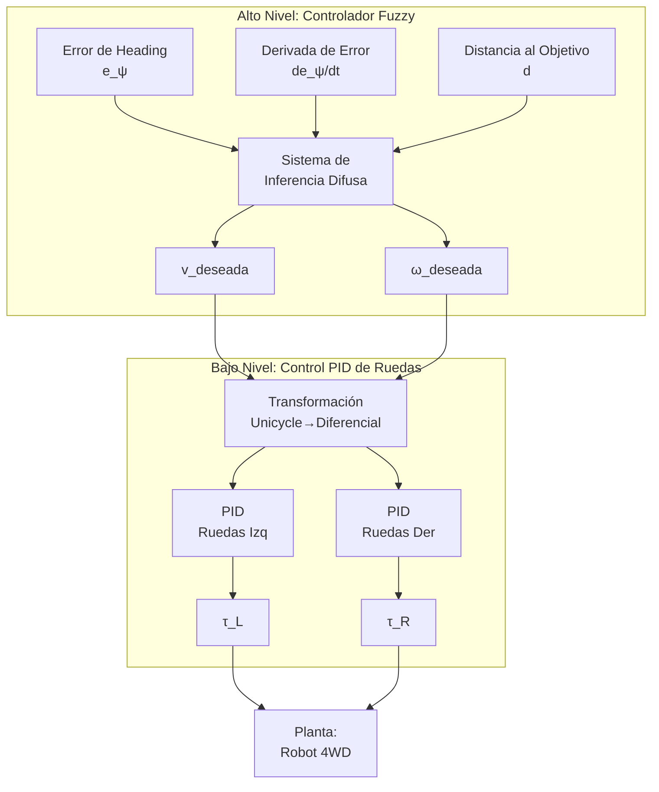

# Procedimiento de Modelado: Robot 4WD Skid-Steer en Terreno 3D

Este documento describe el procedimiento completo del modelado matemático de un robot móvil 4WD (cuatro ruedas motrices) con arquitectura Skid-Steer, diseñado para operación en terreno tridimensional con pendientes variables.

---

## Parte I: Modelo Dinámico del Robot

### 1.1 Definición del Vector de Estado

El robot se modela como un cuerpo rígido con **12 estados**:

$$
\mathbf{X} = \begin{bmatrix} x & y & z & \phi & \theta & \psi & u & v & w & p & q & r \end{bmatrix}^T
$$

| Índice | Variable  | Descripción                          | Unidades |
| ------ | --------- | ------------------------------------ | -------- |
| 1-3    | $x, y, z$ | Posición en marco inercial           | m        |
| 4      | $\phi$    | Ángulo Roll (balanceo lateral)       | rad      |
| 5      | $\theta$  | Ángulo Pitch (cabeceo)               | rad      |
| 6      | $\psi$    | Ángulo Yaw (guiñada)                 | rad      |
| 7-9    | $u, v, w$ | Velocidades lineales (marco cuerpo)  | m/s      |
| 10-12  | $p, q, r$ | Velocidades angulares (marco cuerpo) | rad/s    |

### 1.2 Sistemas de Referencia

Se utilizan dos marcos de referencia:

1. **Marco Inercial (I)**: Sistema fijo en la Tierra con Z apuntando hacia arriba
2. **Marco del Cuerpo (B)**: Sistema fijo al robot con X hacia adelante, Y hacia la izquierda, Z hacia arriba

### 1.3 Matriz de Rotación (Cuerpo → Inercial)

Se utiliza la convención **ZYX (Yaw-Pitch-Roll)** para transformar vectores del marco del cuerpo al inercial:

$$
\mathbf{R}_{IB} = \mathbf{R}_z(\psi) \cdot \mathbf{R}_y(\theta) \cdot \mathbf{R}_x(\phi)
$$

Expandida:

$$
\mathbf{R}_{IB} = \begin{bmatrix}
c_\theta c_\psi & s_\phi s_\theta c_\psi - c_\phi s_\psi & c_\phi s_\theta c_\psi + s_\phi s_\psi \\
c_\theta s_\psi & s_\phi s_\theta s_\psi + c_\phi c_\psi & c_\phi s_\theta s_\psi - s_\phi c_\psi \\
s_\theta & -s_\phi c_\theta & c_\phi c_\theta
\end{bmatrix}
$$

Donde $c_x = \cos(x)$ y $s_x = \sin(x)$.

### 1.4 Cinemática de Velocidades

**Velocidades lineales en marco inercial:**

$$
\begin{bmatrix} \dot{x} \\ \dot{y} \\ \dot{z} \end{bmatrix} = \mathbf{R}_{IB} \begin{bmatrix} u \\ v \\ w \end{bmatrix}
$$

**Tasas de ángulos de Euler:**

$$
\begin{bmatrix} \dot{\phi} \\ \dot{\theta} \\ \dot{\psi} \end{bmatrix} = \mathbf{T}(\phi, \theta) \begin{bmatrix} p \\ q \\ r \end{bmatrix}
$$

Donde:

$$
\mathbf{T} = \begin{bmatrix}
1 & \sin\phi \tan\theta & \cos\phi \tan\theta \\
0 & \cos\phi & -\sin\phi \\
0 & \sin\phi / \cos\theta & \cos\phi / \cos\theta
\end{bmatrix}
$$

> [!WARNING]
> Esta transformación tiene singularidad cuando $\theta = \pm 90°$ (gimbal lock).

### 1.5 Ecuaciones de Newton-Euler

La dinámica del robot sigue las ecuaciones de Newton-Euler para cuerpos rígidos:

**Dinámica Traslacional:**

$$
m \dot{\mathbf{v}}_B = \mathbf{F}_{total} - \boldsymbol{\omega} \times (m \mathbf{v}_B)
$$

**Dinámica Rotacional:**

$$
\mathbf{I} \dot{\boldsymbol{\omega}} = \boldsymbol{\tau}_{total} - \boldsymbol{\omega} \times (\mathbf{I} \boldsymbol{\omega})
$$

Donde:
- $m$ = masa del robot (30 kg)
- $\mathbf{I}$ = tensor de inercia (diagonal: $[0.5, 0.8, 0.8]$ kg·m²)
- $\mathbf{v}_B = [u, v, w]^T$ = velocidad del cuerpo
- $\boldsymbol{\omega} = [p, q, r]^T$ = velocidad angular

---

## Parte II: Modelo de Interacción Neumático-Suelo

### 2.1 Geometría de Contacto

El robot tiene 4 ruedas ubicadas en posiciones relativas al centro de masa:

| Rueda            | Posición $\mathbf{d}_i$ (X, Y, Z) |
| ---------------- | --------------------------------- |
| FL (Front-Left)  | $(+L/2, +W/2, -h)$                |
| FR (Front-Right) | $(+L/2, -W/2, -h)$                |
| RL (Rear-Left)   | $(-L/2, +W/2, -h)$                |
| RR (Rear-Right)  | $(-L/2, -W/2, -h)$                |

Donde:
- $L$ = distancia entre ejes (0.6 m)
- $W$ = ancho del robot (0.6 m)
- $h$ = altura del chasis (0.45 m)

### 2.2 Velocidad en Cada Punto de Contacto

$$
\mathbf{v}_{wheel,i} = \mathbf{v}_B + \boldsymbol{\omega} \times \mathbf{d}_i
$$

### 2.3 Modelo de Fuerzas de Tracción

Para cada rueda se calcula:

**1. Fuerza Normal (Vertical):**

$$
N_i = \frac{m g \cos\theta \cos\phi}{4}
$$

Con amortiguamiento vertical:

$$
F_{z,i} = N_i - k_{damp} \cdot v_{contact,z}
$$

**2. Fuerza Longitudinal (Tracción):**

$$
F_{x,desired} = \frac{\tau_{motor}}{r_{wheel}}
$$

Limitada por fricción (Círculo de Kamm):

$$
F_{x,i} = \text{sign}(F_{x,desired}) \cdot \min(|F_{x,desired}|, \mu_s N_i)
$$

**3. Fuerza Lateral (Resistencia al Skid):**

$$
F_{y,i} = -\mu_{lateral} N_i \cdot \tanh(k_{smooth} \cdot v_{lateral,i})
$$

Esta fuerza se opone al deslizamiento lateral y es crucial para el funcionamiento del Skid-Steer.

### 2.4 Torques Generados por las Ruedas

$$
\boldsymbol{\tau}_{tires} = \sum_{i=1}^{4} \mathbf{d}_i \times \mathbf{F}_i
$$

Donde $\mathbf{F}_i = [F_{x,i}, F_{y,i}, F_{z,i}]^T$.

---

## Parte III: Efecto de la Gravedad en Pendientes

### 3.1 Proyección de Gravedad al Marco del Cuerpo

$$
\mathbf{F}_{gravity,B} = \mathbf{R}_{IB}^T \begin{bmatrix} 0 \\ 0 \\ -mg \end{bmatrix}
$$

Esto produce componentes en X e Y que tienden a hacer que el robot se deslice pendiente abajo.

### 3.2 Componentes de Fuerza Gravitacional

- **Componente X (longitudinal):** $F_{gx} = -mg \sin\theta$ (frena o acelera según inclinación)
- **Componente Y (lateral):** $F_{gy} = mg \sin\phi \cos\theta$ (desliza hacia un lado)
- **Componente Z (normal):** $F_{gz} = -mg \cos\theta \cos\phi$ (reduce tracción disponible)

---

## Parte IV: Parámetros Físicos del Sistema

| Parámetro            | Símbolo      | Valor | Unidades |
| -------------------- | ------------ | ----- | -------- |
| Masa                 | $m$          | 30    | kg       |
| Inercia Ix           | $I_{xx}$     | 0.5   | kg·m²    |
| Inercia Iy           | $I_{yy}$     | 0.8   | kg·m²    |
| Inercia Iz           | $I_{zz}$     | 0.8   | kg·m²    |
| Radio rueda          | $r$          | 0.2   | m        |
| Distancia entre ejes | $L$          | 0.6   | m        |
| Ancho del robot      | $W$          | 0.6   | m        |
| Altura chasis        | $h$          | 0.45  | m        |
| Fricción estática    | $\mu_s$      | 0.5   | -        |
| Fricción lateral     | $\mu_{lat}$  | 0.4   | -        |
| Torque máximo        | $\tau_{max}$ | 10    | Nm       |

---

# Parte V: Modelado del Controlador Fuzzy

## 5.1 Arquitectura de Control en Cascada

El sistema utiliza una arquitectura de control jerárquica:

## 5.2 Sistema de Inferencia Difusa (FIS)

### Configuración del FIS

- **Tipo:** Mamdani
- **Nombre:** YawRateController
- **Método de defuzzificación:** Centroide

### 5.2.1 Variables de Entrada

**Entrada 1: Error de Heading ($e_\psi$)**

| Conjunto | Tipo  | Parámetros                   | Descripción                |
| -------- | ----- | ---------------------------- | -------------------------- |
| N_Large  | trimf | $[-\pi, -\pi, -\pi/2]$       | Error negativo grande      |
| N_Med    | trimf | $[-2\pi/3, -\pi/3, -\pi/12]$ | Error negativo medio       |
| Zero     | trimf | $[-\pi/6, 0, \pi/6]$         | Error aproximadamente cero |
| P_Med    | trimf | $[\pi/12, \pi/3, 2\pi/3]$    | Error positivo medio       |
| P_Large  | trimf | $[\pi/2, \pi, \pi]$          | Error positivo grande      |

**Entrada 2: Derivada del Error ($\dot{e}_\psi$)**

| Conjunto | Tipo  | Parámetros       | Descripción       |
| -------- | ----- | ---------------- | ----------------- |
| Neg      | trimf | $[-2, -2, -0.2]$ | Derivada negativa |
| Zero     | trimf | $[-0.5, 0, 0.5]$ | Derivada cero     |
| Pos      | trimf | $[0.2, 2, 2]$    | Derivada positiva |

**Entrada 3: Distancia al Objetivo ($d$)**

| Conjunto  | Tipo  | Parámetros    | Descripción       |
| --------- | ----- | ------------- | ----------------- |
| VeryClose | trimf | $[0, 0, 0.5]$ | Muy cerca (<0.5m) |
| Close     | trimf | $[0.2, 2, 4]$ | Cerca (0.2-4m)    |
| Medium    | trimf | $[3, 8, 15]$  | Media (3-15m)     |
| Far       | trimf | $[8, 20, 20]$ | Lejos (>8m)       |

### 5.2.2 Variables de Salida

**Salida 1: Velocidad Deseada ($v_{ref}$)** - Rango: [0, 1.5] m/s

| Conjunto | Parámetros        | Velocidad típica |
| -------- | ----------------- | ---------------- |
| Stop     | $[0, 0, 0.05]$    | 0 m/s            |
| Slow     | $[0, 0.15, 0.3]$  | ~0.15 m/s        |
| Medium   | $[0.2, 0.6, 1.0]$ | ~0.6 m/s         |
| Fast     | $[0.8, 1.0, 1.5]$ | ~1.0 m/s         |

**Salida 2: Velocidad Angular Deseada ($\omega_{ref}$)** - Rango: [-3, 3] rad/s

| Conjunto       | Parámetros           | Acción                |
| -------------- | -------------------- | --------------------- |
| TurnLeft_Fast  | $[-3, -3, -2]$       | Giro rápido izquierda |
| TurnLeft_Med   | $[-2.5, -1.5, -0.8]$ | Giro medio izquierda  |
| TurnLeft_Slow  | $[-1.2, -0.8, -0.2]$ | Giro lento izquierda  |
| Straight       | $[-0.3, 0, 0.3]$     | Línea recta           |
| TurnRight_Slow | $[0.2, 0.8, 1.2]$    | Giro lento derecha    |
| TurnRight_Med  | $[0.8, 1.5, 2.5]$    | Giro medio derecha    |
| TurnRight_Fast | $[2, 3, 3]$          | Giro rápido derecha   |

### 5.2.3 Base de Reglas

| #   | Condición                          | Acción                                |
| --- | ---------------------------------- | ------------------------------------- |
| 1   | SI distancia = VeryClose           | ENTONCES v = Stop, ω = Straight       |
| 2   | SI distancia = Close               | ENTONCES v = Slow                     |
| 3   | SI e_ψ = N_Large                   | ENTONCES v = Stop, ω = TurnLeft_Fast  |
| 4   | SI e_ψ = P_Large                   | ENTONCES v = Stop, ω = TurnRight_Fast |
| 5   | SI e_ψ = N_Med                     | ENTONCES v = Stop, ω = TurnLeft_Med   |
| 6   | SI e_ψ = P_Med                     | ENTONCES v = Stop, ω = TurnRight_Med  |
| 7   | SI e_ψ = Zero                      | ENTONCES ω = Straight                 |
| 8   | SI e_ψ = Zero Y distancia = Medium | ENTONCES v = Medium                   |
| 9   | SI e_ψ = Zero Y distancia = Far    | ENTONCES v = Fast                     |
| 10  | SI e_ψ = Zero Y de_ψ = Neg         | ENTONCES ω = TurnRight_Slow (damping) |
| 11  | SI e_ψ = Zero Y de_ψ = Pos         | ENTONCES ω = TurnLeft_Slow (damping)  |

## 5.3 Controlador PID de Velocidad de Ruedas

El nivel bajo transforma las velocidades deseadas a torques individuales por rueda.

### 5.3.1 Transformación Unicycle → Diferencial

$$
v_{L,cmd} = v_{ref} - \frac{\omega_{ref} \cdot W}{2}
$$

$$
v_{R,cmd} = v_{ref} + \frac{\omega_{ref} \cdot W}{2}
$$

Luego se convierte a velocidades angulares de rueda:

$$
\omega_{wheel} = \frac{v_{wheel}}{r}
$$

### 5.3.2 Ley de Control PID

$$
\tau = K_p e_\omega + K_i \int e_\omega \, dt + K_d \frac{de_\omega}{dt} + \tau_{ff}
$$

**Ganancias por defecto:**
- $K_p = 15.0$
- $K_i = 7.0$
- $K_d = 0.09$

### 5.3.3 Compensación Feedforward

$$
\tau_{ff} = I_{wheel} \cdot \frac{\omega_{desired} - \omega_{actual}}{\Delta t}
$$

Donde $I_{wheel} = 0.05$ kg·m² es la inercia de la rueda.

### 5.3.4 Lógica Anti-Windup

- Límite integral: $\pm 5.0$
- Saturación de torque: $\pm \tau_{max}$

## 5.4 Lógica de Parada Activa

Para evitar oscilaciones cerca del objetivo:

| Distancia         | Acción                               |
| ----------------- | ------------------------------------ |
| $d < 0.1$ m       | $v = 0$, $\omega = 0$ (parada total) |
| $0.1 < d < 0.2$ m | $\omega = 0$, $v \leq 0.2$ m/s       |
| $d \geq 0.2$ m    | Control normal                       |

---

## Referencias a Código Fuente

- Modelo dinámico: [skid_steer_robot_model.m](file:///home/hackbrian/Documents/gits/RoboticsLab_DRM/Control_lab/final_work/system/skid_steer_robot_model.m)
- Controlador Fuzzy: [fuzzy_yaw_rate_controller.m](file:///home/hackbrian/Documents/gits/RoboticsLab_DRM/Control_lab/final_work/controllers/fuzzy_yaw_rate_controller.m)
- Configuración FIS: [fuzzy_yaw_rate_controller_setup.m](file:///home/hackbrian/Documents/gits/RoboticsLab_DRM/Control_lab/final_work/controllers/fuzzy_yaw_rate_controller_setup.m)
- Parámetros: [robot_parameters.m](file:///home/hackbrian/Documents/gits/RoboticsLab_DRM/Control_lab/final_work/config/robot_parameters.m)
