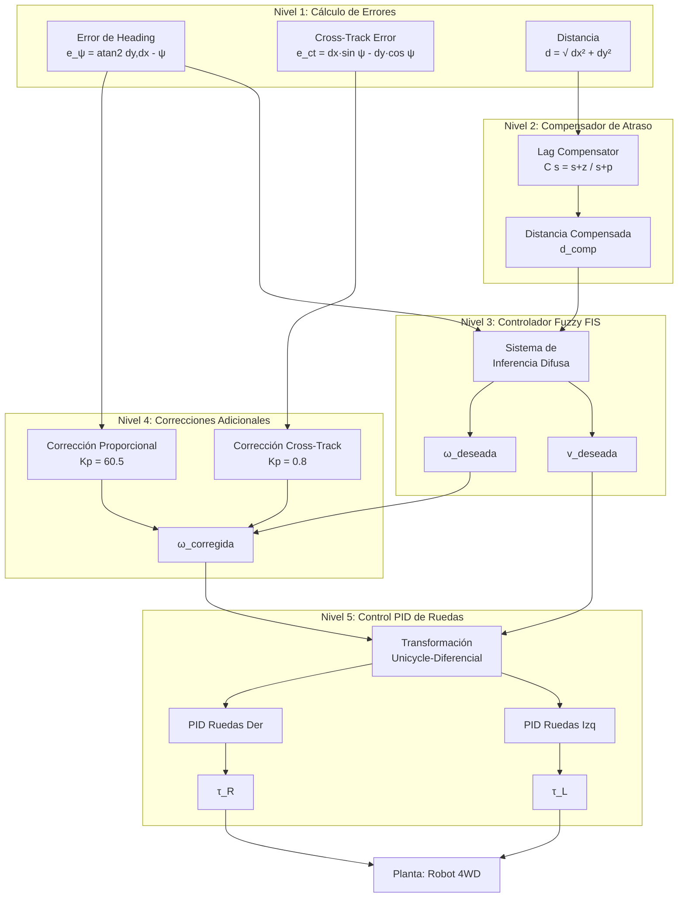
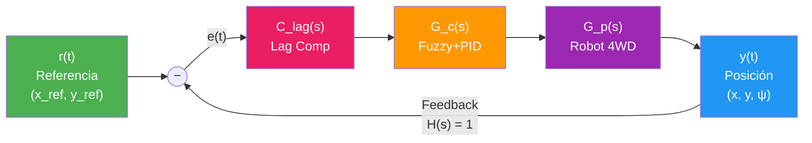

# Procedimiento de Modelado: Robot 4WD Skid-Steer en Terreno 3D

Este documento describe el procedimiento completo del modelado matemático de un robot móvil 4WD (cuatro ruedas motrices) con arquitectura Skid-Steer, diseñado para operación en terreno tridimensional con pendientes variables.

---

## Parte I: Modelo Dinámico del Robot

### 1.1 Definición del Vector de Estado

El robot se modela como un cuerpo rígido con **12 estados**:

$$
\mathbf{X} = \begin{bmatrix} x & y & z & \phi & \theta & \psi & u & v & w & p & q & r \end{bmatrix}^T
$$

| Índice | Variable  | Descripción                          | Unidades |
| ------ | --------- | ------------------------------------ | -------- |
| 1-3    | $x, y, z$ | Posición en marco inercial           | m        |
| 4      | $\phi$    | Ángulo Roll (balanceo lateral)       | rad      |
| 5      | $\theta$  | Ángulo Pitch (cabeceo)               | rad      |
| 6      | $\psi$    | Ángulo Yaw (guiñada)                 | rad      |
| 7-9    | $u, v, w$ | Velocidades lineales (marco cuerpo)  | m/s      |
| 10-12  | $p, q, r$ | Velocidades angulares (marco cuerpo) | rad/s    |

### 1.2 Sistemas de Referencia

Se utilizan dos marcos de referencia:

1. **Marco Inercial (I)**: Sistema fijo en la Tierra con Z apuntando hacia arriba
2. **Marco del Cuerpo (B)**: Sistema fijo al robot con X hacia adelante, Y hacia la izquierda, Z hacia arriba

### 1.3 Matriz de Rotación (Cuerpo → Inercial)

Se utiliza la convención **ZYX (Yaw-Pitch-Roll)** para transformar vectores del marco del cuerpo al inercial:

$$
\mathbf{R}_{IB} = \mathbf{R}_z(\psi) \cdot \mathbf{R}_y(\theta) \cdot \mathbf{R}_x(\phi)
$$

Expandida:

$$
\mathbf{R}_{IB} = \begin{bmatrix}
c_\theta c_\psi & s_\phi s_\theta c_\psi - c_\phi s_\psi & c_\phi s_\theta c_\psi + s_\phi s_\psi \\
c_\theta s_\psi & s_\phi s_\theta s_\psi + c_\phi c_\psi & c_\phi s_\theta s_\psi - s_\phi c_\psi \\
s_\theta & -s_\phi c_\theta & c_\phi c_\theta
\end{bmatrix}
$$

Donde $c_x = \cos(x)$ y $s_x = \sin(x)$.

### 1.4 Cinemática de Velocidades

**Velocidades lineales en marco inercial:**

$$
\begin{bmatrix} \dot{x} \\ \dot{y} \\ \dot{z} \end{bmatrix} = \mathbf{R}_{IB} \begin{bmatrix} u \\ v \\ w \end{bmatrix}
$$

**Tasas de ángulos de Euler:**

$$
\begin{bmatrix} \dot{\phi} \\ \dot{\theta} \\ \dot{\psi} \end{bmatrix} = \mathbf{T}(\phi, \theta) \begin{bmatrix} p \\ q \\ r \end{bmatrix}
$$

Donde:

$$
\mathbf{T} = \begin{bmatrix}
1 & \sin\phi \tan\theta & \cos\phi \tan\theta \\
0 & \cos\phi & -\sin\phi \\
0 & \sin\phi / \cos\theta & \cos\phi / \cos\theta
\end{bmatrix}
$$

> [!WARNING]
> Esta transformación tiene singularidad cuando $\theta = \pm 90°$ (gimbal lock).

### 1.5 Ecuaciones de Newton-Euler

La dinámica del robot sigue las ecuaciones de Newton-Euler para cuerpos rígidos:

**Dinámica Traslacional:**

$$
m \dot{\mathbf{v}}_B = \mathbf{F}_{total} - \boldsymbol{\omega} \times (m \mathbf{v}_B)
$$

**Dinámica Rotacional:**

$$
\mathbf{I} \dot{\boldsymbol{\omega}} = \boldsymbol{\tau}_{total} - \boldsymbol{\omega} \times (\mathbf{I} \boldsymbol{\omega})
$$

Donde:
- $m$ = masa del robot (30 kg)
- $\mathbf{I}$ = tensor de inercia (diagonal: $[1.41, 1.41, 1.80]$ kg·m²)
- $\mathbf{v}_B = [u, v, w]^T$ = velocidad del cuerpo
- $\boldsymbol{\omega} = [p, q, r]^T$ = velocidad angular

---

## Parte II: Modelo de Interacción Neumático-Suelo

### 2.1 Geometría de Contacto

El robot tiene 4 ruedas ubicadas en posiciones relativas al centro de masa:

| Rueda            | Posición $\mathbf{d}_i$ (X, Y, Z) |
| ---------------- | --------------------------------- |
| FL (Front-Left)  | $(+L/2, +W/2, -h)$                |
| FR (Front-Right) | $(+L/2, -W/2, -h)$                |
| RL (Rear-Left)   | $(-L/2, +W/2, -h)$                |
| RR (Rear-Right)  | $(-L/2, -W/2, -h)$                |

Donde:
- $L$ = distancia entre ejes (0.6 m)
- $W$ = ancho del robot (0.6 m)
- $h$ = altura del chasis (0.45 m)

### 2.2 Velocidad en Cada Punto de Contacto

$$
\mathbf{v}_{wheel,i} = \mathbf{v}_B + \boldsymbol{\omega} \times \mathbf{d}_i
$$

### 2.3 Modelo de Fuerzas de Tracción

Para cada rueda se calcula:

**1. Fuerza Normal (Vertical):**

$$
N_i = \frac{m g \cos\theta \cos\phi}{4}
$$

Con amortiguamiento vertical:

$$
F_{z,i} = N_i - k_{damp} \cdot v_{contact,z}
$$

**2. Fuerza Longitudinal (Tracción):**

$$
F_{x,desired} = \frac{\tau_{motor}}{r_{wheel}}
$$

Limitada por fricción (Círculo de Kamm):

$$
F_{x,i} = \text{sign}(F_{x,desired}) \cdot \min(|F_{x,desired}|, \mu_s N_i)
$$

**3. Fuerza Lateral (Resistencia al Skid):**

$$
F_{y,i} = -\mu_{lateral} N_i \cdot \tanh(k_{smooth} \cdot v_{lateral,i})
$$

Esta fuerza se opone al deslizamiento lateral y es crucial para el funcionamiento del Skid-Steer.

### 2.4 Torques Generados por las Ruedas

$$
\boldsymbol{\tau}_{tires} = \sum_{i=1}^{4} \mathbf{d}_i \times \mathbf{F}_i
$$

Donde $\mathbf{F}_i = [F_{x,i}, F_{y,i}, F_{z,i}]^T$.

---

## Parte III: Efecto de la Gravedad en Pendientes

### 3.1 Proyección de Gravedad al Marco del Cuerpo

$$
\mathbf{F}_{gravity,B} = \mathbf{R}_{IB}^T \begin{bmatrix} 0 \\ 0 \\ -mg \end{bmatrix}
$$

Esto produce componentes en X e Y que tienden a hacer que el robot se deslice pendiente abajo.

### 3.2 Componentes de Fuerza Gravitacional

- **Componente X (longitudinal):** $F_{gx} = -mg \sin\theta$ (frena o acelera según inclinación)
- **Componente Y (lateral):** $F_{gy} = mg \sin\phi \cos\theta$ (desliza hacia un lado)
- **Componente Z (normal):** $F_{gz} = -mg \cos\theta \cos\phi$ (reduce tracción disponible)

---

## Parte IV: Parámetros Físicos del Sistema

| Parámetro            | Símbolo      | Valor | Unidades |
| -------------------- | ------------ | ----- | -------- |
| Masa                 | $m$          | 30    | kg       |
| Inercia Ix           | $I_{xx}$     | 1.41  | kg·m²    |
| Inercia Iy           | $I_{yy}$     | 1.41  | kg·m²    |
| Inercia Iz           | $I_{zz}$     | 1.80  | kg·m²    |
| Radio rueda          | $r$          | 0.2   | m        |
| Distancia entre ejes | $L$          | 0.6   | m        |
| Ancho del robot      | $W$          | 0.6   | m        |
| Altura chasis        | $h$          | 0.45  | m        |
| Fricción estática    | $\mu_s$      | 0.6   | -        |
| Fricción cinética    | $\mu_k$      | 0.5   | -        |
| Fricción lateral     | $\mu_{lat}$  | 0.45  | -        |
| Fricción viscosa     | $C_d$        | 5.0   | Ns/m     |
| Torque máximo        | $\tau_{max}$ | 10    | Nm       |

---

# Parte V: Sistema de Control

## 5.1 Arquitectura de Control en Cascada

El sistema utiliza una arquitectura de control jerárquica con múltiples etapas de corrección:

### Diagrama de Bloques con Retroalimentación (Estilo Simulink)

El siguiente diagrama muestra el sistema de control completo con los lazos de retroalimentación explícitos:

```mermaid
flowchart LR
    subgraph INPUT["🎯 REFERENCIA"]
        REF["x_ref, y_ref<br/>(Objetivo)"]
    end
    
    subgraph FEEDBACK_CALC["📐 CÁLCULO DE ERROR"]
        direction TB
        SUM1(("Σ"))
        SUM1 --> |"dx, dy"| ERR_CALC["Cálculo de Errores<br/>• e_ψ = atan2(dy,dx) - ψ<br/>• d = √(dx² + dy²)<br/>• e_ct = dx·sin(ψ) - dy·cos(ψ)"]
    end
    
    subgraph COMPENSATOR["⚙️ COMPENSADORES"]
        direction TB
        LAG_C["LAG COMPENSATOR<br/>C(s) = (s+0.05)/(s+0.003)<br/>α = 15.5"]
        PROP_C["PROPORCIONAL<br/>Kp_heading = 60.5<br/>Kp_crosstrack = 0.8"]
    end
    
    subgraph CONTROLLER["🧠 CONTROLADOR FUZZY"]
        direction TB
        FIS_C["FIS MAMDANI<br/>21 Reglas<br/>Entradas: e_ψ, ė_ψ, d_comp<br/>Salidas: v, ω"]
        SUM2(("Σ"))
        FIS_C --> SUM2
    end
    
    subgraph PID_CTRL["🔧 PID RUEDAS"]
        direction TB
        UNICYCLE["Unicycle → Diff<br/>v_L = v - ωW/2<br/>v_R = v + ωW/2"]
        PID_WHEELS["PID<br/>Kp=30, Ki=50, Kd=0"]
    end
    
    subgraph PLANT_BOX["🤖 PLANTA"]
        direction TB
        DYNAMICS["DINÁMICA DEL ROBOT<br/>Newton-Euler 12 Estados<br/>Interacción Neumático-Suelo"]
        SENSORS["SENSORES<br/>x, y, z, ψ, v, ω"]
    end
    
    %% Flujo principal
    REF --> SUM1
    ERR_CALC --> |"d"| LAG_C
    ERR_CALC --> |"e_ψ, e_ct"| PROP_C
    LAG_C --> |"d_comp"| FIS_C
    ERR_CALC --> |"e_ψ, ė_ψ"| FIS_C
    PROP_C --> |"ω_corr"| SUM2
    SUM2 --> |"v, ω_total"| UNICYCLE
    UNICYCLE --> |"v_L, v_R"| PID_WHEELS
    PID_WHEELS --> |"τ_L, τ_R"| DYNAMICS
    DYNAMICS --> SENSORS
    
    %% RETROALIMENTACIÓN
    SENSORS --> |"x, y, ψ, v, ω<br/>📡 FEEDBACK"| SUM1
    
    %% Estilos
    style INPUT fill:#e1f5fe,stroke:#0288d1
    style FEEDBACK_CALC fill:#fff3e0,stroke:#ff9800
    style COMPENSATOR fill:#f3e5f5,stroke:#9c27b0
    style CONTROLLER fill:#e8f5e9,stroke:#4caf50
    style PID_CTRL fill:#fce4ec,stroke:#e91e63
    style PLANT_BOX fill:#eceff1,stroke:#607d8b
```

### Diagrama Simplificado de Lazo Cerrado

**Función de Transferencia de Lazo Cerrado:**

$$
\frac{Y(s)}{R(s)} = \frac{C_{lag}(s) \cdot G_c(s) \cdot G_p(s)}{1 + C_{lag}(s) \cdot G_c(s) \cdot G_p(s)}
$$

---

## 5.2 Compensador de Atraso (Lag Compensator)

El compensador de atraso se aplica **antes** del FIS para eliminar el error en estado estacionario.

### 5.2.1 Función de Transferencia

$$
C_{lag}(s) = \frac{s + z}{s + p}, \quad z > p
$$

### 5.2.2 Parámetros Actuales

| Parámetro        | Símbolo    | Valor         | Descripción     |
| ---------------- | ---------- | ------------- | --------------- |
| Factor de mejora | $\alpha$   | 15.5          | Ratio z/p       |
| Frecuencia cruce | $\omega_c$ | 0.5 rad/s     | Estimación      |
| Cero             | $z$        | 0.05 rad/s    | $\omega_c / 10$ |
| Polo             | $p$        | 0.00323 rad/s | $z / \alpha$    |

### 5.2.3 Implementación Discreta (Euler)

$$
x_{lag}[k+1] = (1 - p \cdot dt) \cdot x_{lag}[k] + dt \cdot d[k]
$$

$$
d_{comp}[k] = d[k] + (z - p) \cdot x_{lag}[k]
$$

### 5.2.4 Condiciones de Activación

| Distancia      | Acción                  |
| -------------- | ----------------------- |
| $d < 2.0$ m    | Compensador activo      |
| $d \geq 2.0$ m | Compensador desactivado |

> [!TIP]
> El compensador puede deshabilitarse con `params.use_lag_compensator = false`.

---

## 5.3 Sistema de Inferencia Difusa (FIS)

### Configuración

- **Tipo:** Mamdani
- **Nombre:** YawRateController
- **Defuzzificación:** Centroide

### 5.3.1 Variables de Entrada

**Error de Heading ($e_\psi$)** - Rango: $[-\pi, \pi]$

| Conjunto | Parámetros                  | Descripción            |
| -------- | --------------------------- | ---------------------- |
| N_Large  | $[-\pi, -\pi, -\pi/2]$      | Error negativo grande  |
| N_Med    | $[-\pi/2, -\pi/4, -\pi/18]$ | Error negativo medio   |
| Zero     | $[-\pi/12, 0, \pi/12]$      | Error ≈ 0 (±15°)       |
| P_Med    | $[\pi/18, \pi/4, \pi/2]$    | Error positivo medio   |
| P_Large  | $[\pi/2, \pi, \pi]$         | Error positivo grande  |
| N_Small  | $[-\pi/6, -\pi/12, 0]$      | Error pequeño negativo |
| P_Small  | $[0, \pi/12, \pi/6]$        | Error pequeño positivo |

**Distancia ($d$)** - Rango: $[0, 20]$ m

| Conjunto  | Parámetros    | Descripción |
| --------- | ------------- | ----------- |
| VeryClose | $[0, 0, 0.5]$ | Muy cerca   |
| Close     | $[0.2, 2, 4]$ | Cerca       |
| Medium    | $[3, 8, 15]$  | Media       |
| Far       | $[8, 20, 20]$ | Lejos       |

### 5.3.2 Variables de Salida

**Velocidad Angular ($\omega$)** - Rango: $[-4, 4]$ rad/s

| Conjunto       | Parámetros         | Acción              |
| -------------- | ------------------ | ------------------- |
| TurnLeft_Fast  | $[-4, -4, -2.5]$   | Giro rápido izq     |
| TurnLeft_Med   | $[-3, -2, -1]$     | Giro medio izq      |
| TurnLeft_Slow  | $[-1.5, -1, -0.3]$ | Giro lento izq      |
| TurnLeft_Tiny  | $[-0.5, -0.25, 0]$ | Corrección fina izq |
| Straight       | $[-0.15, 0, 0.15]$ | Recto               |
| TurnRight_Tiny | $[0, 0.25, 0.5]$   | Corrección fina der |
| TurnRight_Slow | $[0.3, 1, 1.5]$    | Giro lento der      |
| TurnRight_Med  | $[1, 2, 3]$        | Giro medio der      |
| TurnRight_Fast | $[2.5, 4, 4]$      | Giro rápido der     |

---

## 5.4 Corrección de Cross-Track Error

$$
e_{ct} = dx \cdot \sin(\psi) - dy \cdot \cos(\psi)
$$

$$
\omega_{ct} = K_{p,ct} \cdot e_{ct}, \quad K_{p,ct} = 0.8 \text{ rad/s/m}
$$

---

## 5.5 Corrección Proporcional de Heading

$$
\omega_{corr} = K_{p,\psi} \cdot e_\psi, \quad K_{p,\psi} = 60.5 \text{ rad/s/rad}
$$

Activación: $|e_\psi| > 0.03$ rad y $|\omega_{FIS}| < 0.1$ rad/s.

---

## 5.6 Controlador PID de Ruedas

### Transformación Unicycle → Diferencial

$$
v_{L} = v_{ref} - \frac{\omega_{ref} \cdot W}{2}, \quad v_{R} = v_{ref} + \frac{\omega_{ref} \cdot W}{2}
$$

### Ganancias PID

| Parámetro | Valor |
| --------- | ----- |
| $K_p$     | 30.0  |
| $K_i$     | 50.0  |
| $K_d$     | 0.0   |

---

## 5.7 Lógica de Parada Activa

| Distancia            | Acción                         |
| -------------------- | ------------------------------ |
| $d < 0.005$ m        | Parada total                   |
| $0.005 < d < 0.01$ m | $\omega = 0$, $v \leq 0.1$ m/s |
| $d \geq 0.01$ m      | Control normal                 |

---

## Referencias

- [skid_steer_robot_model.m](system/skid_steer_robot_model.m) - Modelo dinámico
- [fuzzy_yaw_rate_controller.m](controllers/fuzzy_yaw_rate_controller.m) - Controlador
- [fuzzy_yaw_rate_controller_setup.m](controllers/fuzzy_yaw_rate_controller_setup.m) - Config FIS
- [robot_parameters.m](config/robot_parameters.m) - Parámetros
- [test_step_response_closedloop.m](tests/test_step_response_closedloop.m) - Test comparativo
