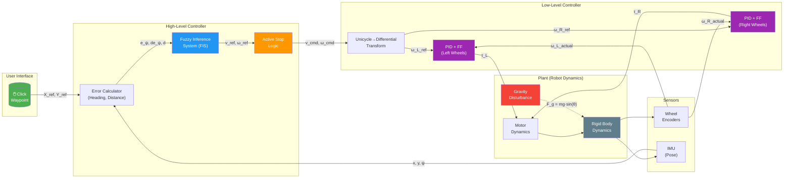

# 4-Wheel Skid-Steer Robot: Fuzzy Path Planning & Control

## 1. Project Overview

This project implements a complete autonomous navigation system for a **4WD Skid-Steer Mobile Robot**. The system is designed to track waypoints accurately on uneven terrain, compensating for gravity and dynamic effects using a **Cascade Control Architecture**:

-   **High-Level**: Fuzzy Logic strategy for path navigation (human-like decision making).
-   **Low-Level**: PID Control with Feedforward for robust actuator tracking and slope holding.

## 2. Mathematical Modeling

### 2.1 Kinematics
Unlike differential drive robots (unicycles) which have a defined center of rotation on the wheel axis, skid-steer robots rely on lateral skidding. We approximate the kinematics using an **Equivalent Unicycle Model** with an extended effective width due to skidding.

Forward linear velocity $v$ and angular velocity $\omega$ are related to wheel velocities $v_L, v_R$:

$$ v = \frac{v_R + v_L}{2} $$
$$ \omega = \frac{v_R - v_L}{W_{eff}} $$

Where $W_{eff}$ is the effective track width (often larger than physical width due to skidding).

### 2.2 System Dynamics
The robot model considers the full rigit body dynamics including traction forces and resistive forces (friction, gravity).

**State Vector** $X = [x, y, z, \phi, \theta, \psi, \dot{x}, \dot{y}, \dot{z}, \dot{\phi}, \dot{\theta}, \dot{\psi}]^T$.

**Newton-Euler Equations of Motion**:
$$ M \ddot{q} + C(\dot{q}) \dot{q} + G(q) = \tau $$

Crucially, the **Gravity Term** $G(q)$ plays a major role on slopes:
$$ F_{gravity\_x} = -m \cdot g \cdot \sin(\theta_{pitch}) $$

If the controller does not compensate for this term, the robot will drift downhill when stopped.

---

## 3. Control Architecture

We utilize a **Cascade Control Strategy** to separate navigation logic from dynamic execution.

### System Block Diagram



### Signal Flow Summary
| Signal         | Description                 | Units      |
| -------------- | --------------------------- | ---------- |
| `X_ref, Y_ref` | Target waypoint coordinates | m          |
| `e_ψ`          | Heading error (wrapped)     | rad        |
| `v_ref, ω_ref` | Fuzzy output velocities     | m/s, rad/s |
| `ω_L, ω_R`     | Wheel angular velocities    | rad/s      |
| `τ_L, τ_R`     | Motor torques               | Nm         |
| `F_g`          | Gravity disturbance force   | N          |

### 3.1 High-Level: Fuzzy Yaw-Rate Controller
**Objective**: Determine the desired motion command $(v_{ref}, \omega_{ref})$ based on Position Error.

*   **Inputs**:
    *   $e_{\psi}$ (Heading Error): Difference between current yaw and target angle.
    *   $\dot{e}_{\psi}$ (Heading Derivative): Rate of change of error (damping).
    *   $d$ (Distance): Euclidean distance to target.

*   **Logic (Mamdani FIS)**:
    *   *Rule Example*: "IF Distance is Close AND Heading Error is Zero THEN Speed is Slow".
    *   *Rule Example*: "IF Heading Error is Negative Large THEN Omega is Negative Fast (Turn Right)".

### 3.2 Low-Level: PID + Feedforward Wheel Control
**Objective**: Force the wheels to spin at the speeds commanded by the Fuzzy controller, regardless of terrain/gravity.

**Transformation**:
$$ v_{L,cmd} = v_{ref} - \frac{\omega_{ref} \cdot W}{2} $$
$$ v_{R,cmd} = v_{ref} + \frac{\omega_{ref} \cdot W}{2} $$

**Control Law** (for each wheel side):
$$ \tau_{motor} = K_p e_v + K_i \int e_v dt + K_d \frac{de_v}{dt} + \tau_{ff} $$

*   **Integral Action ($K_i$)**: Vital for **Active Position Hold**. On a slope, even if $v_{cmd}=0$, gravity creates a velocity error. The integral term accumulates this error and generates equal-and-opposite torque to hold the robot in place.
*   **Feedforward ($\tau_{ff}$)**: $J \cdot \alpha_{ref}$. Compensates for wheel inertia during acceleration.

---

## 4. Implementation Details

### 4.1 "Active Stop" Logic
To prevent "hunting" (oscillating around the target) or drifting, we implemented a hybrid stop logic:

1.  **Deadzone (< 0.5m)**: $\omega_{ref}$ is forced to 0. No turning allowed close to target.
2.  **Parking (< 0.15m)**: $v_{ref}$ is graded to 0.
3.  **Active Hold**: The PID controller remains active. If gravity pulls the robot, the encoders detect movement ($e_v \neq 0$) and the controller fights back immediately.

### 4.2 Interactive Simulation
The system runs in real-time (`realtime_waypoint_click_simulation.m`) featuring:
*   **Physics Loop**: Uses ODE45 solver for realistic dynamics.
*   **User Interface**: Click on the map to set waypoints.
*   **Tuning**: Real-time sliders to adjust PID gains ($K_p, K_i, K_d$) and observe stiffness vs. oscillation.

---

## 5. Usage Instructions

### Prerequisites
*   MATLAB R2023a or newer.
*   Fuzzy Logic Toolbox.

### Running the Simulation
1.  Navigate to the `system/` directory:
    ```matlab
    cd system
    ```
2.  Run the interactive click-to-drive demo:
    ```matlab
    realtime_waypoint_click_simulation
    ```
3.  **Controls**:
    *   **Left Click**: Set a new target point.
    *   **Sliders**: Adjust PID gains in real-time.

### Running Automated Tests
To test specific trajectories (Line, S-Curve, Square, Circle):
1.  Open `waypoint_navigation_simulation.m`.
2.  Set `trajectory_type` to desired string.
3.  Run the script.
