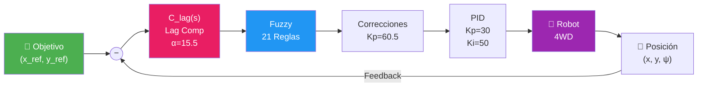
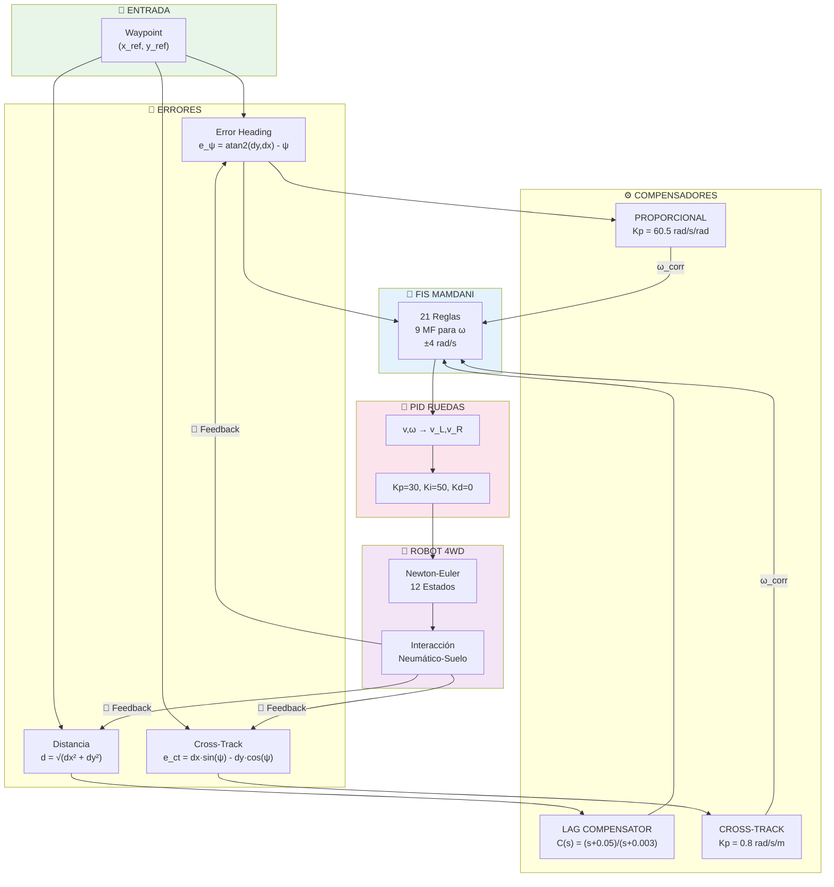

# 🤖 4-Wheel Skid-Steer Robot: Fuzzy Path Planning & Control

Sistema completo de navegación autónoma para un robot móvil 4WD Skid-Steer con control en cascada Fuzzy + PID y compensación de error estacionario.

---

## 📋 Tabla de Contenidos

- [Características](#-características)
- [Arquitectura de Control](#-arquitectura-de-control)
- [Instalación](#-instalación)
- [Uso](#-uso)
- [Estructura del Proyecto](#-estructura-del-proyecto)
- [Documentación Técnica](#-documentación-técnica)

---

## ✨ Características

| Característica             | Descripción                                                        |
| -------------------------- | ------------------------------------------------------------------ |
| **Control Fuzzy**          | Sistema de inferencia Mamdani con 21 reglas y 7 conjuntos de error |
| **Lag Compensator**        | Compensador de atraso para eliminar error estacionario (α = 15.5)  |
| **Cross-Track Correction** | Corrección de deriva lateral durante navegación (Kp = 0.8)         |
| **PID de Ruedas**          | Control de velocidad con Kp=30, Ki=50 y anti-windup                |
| **Modelo Dinámico**        | Newton-Euler 12 estados con interacción neumático-suelo            |
| **Simulación Interactiva** | Click-to-drive en tiempo real con sliders de ajuste                |

---

## 🏗️ Arquitectura de Control

### Diagrama de Lazo Cerrado



### Flujo de Control Detallado



---

## 📦 Instalación

### Requisitos
- **MATLAB** R2023a o superior
- **Fuzzy Logic Toolbox**

### Pasos
```bash
git clone https://github.com/hackbrian/RoboticsLab_DRM.git
cd RoboticsLab_DRM/Control_lab/final_work
```

---

## 🚀 Uso

### Simulación Interactiva (Click-to-Drive)

```matlab
cd system
realtime_waypoint_click_simulation
```

**Controles:**
- **Click Izquierdo**: Establecer nuevo waypoint
- **Sliders**: Ajustar ganancias PID en tiempo real

### Test de Respuesta al Escalón (Comparativo)

```matlab
cd tests
test_step_response_closedloop
```

Compara 3 configuraciones:
1. Solo Fuzzy (sin PID)
2. Fuzzy + PID (sin Lag)
3. Sistema Completo (Fuzzy + PID + Lag)

### Navegación por Waypoints

```matlab
cd system
waypoint_navigation_simulation
```

Tipos de trayectoria: `'line'`, `'circle'`, `'square'`, `'s_curve'`

---

## 📁 Estructura del Proyecto

```
final_work/
├── config/
│   └── robot_parameters.m      # Parámetros físicos del robot
├── controllers/
│   ├── fuzzy_yaw_rate_controller.m       # Controlador principal
│   └── fuzzy_yaw_rate_controller_setup.m # Configuración FIS
├── system/
│   ├── skid_steer_robot_model.m          # Modelo dinámico
│   ├── realtime_waypoint_click_simulation.m  # Demo interactivo
│   └── waypoint_navigation_simulation.m  # Navegación automática
├── tests/
│   ├── test_step_response_closedloop.m   # Test comparativo
│   └── test_step_response_openloop.m     # Test lazo abierto
├── MODELADO_ROBOT.md           # Documentación técnica detallada
└── README.md                   # Este archivo
```

---

## 🎛️ Parámetros del Sistema

### Robot Físico

| Parámetro     | Valor | Unidad |
| ------------- | ----- | ------ |
| Masa          | 30    | kg     |
| Ancho (W)     | 0.6   | m      |
| Largo (L)     | 0.6   | m      |
| Radio rueda   | 0.2   | m      |
| Inercia (Izz) | 1.80  | kg·m²  |
| Torque máx    | 10    | Nm     |

### Controlador

| Componente         | Parámetro | Valor          |
| ------------------ | --------- | -------------- |
| Lag Compensator    | α         | 15.5           |
| Lag Compensator    | z         | 0.05 rad/s     |
| Lag Compensator    | p         | 0.00323 rad/s  |
| Corrección Heading | Kp        | 60.5 rad/s/rad |
| Cross-Track        | Kp        | 0.8 rad/s/m    |
| PID Ruedas         | Kp        | 30             |
| PID Ruedas         | Ki        | 50             |
| PID Ruedas         | Kd        | 0              |

### FIS Fuzzy

| Entrada/Salida | Rango         | Conjuntos                                                  |
| -------------- | ------------- | ---------------------------------------------------------- |
| Error Heading  | [-π, π]       | 7 (N_Large, N_Med, N_Small, Zero, P_Small, P_Med, P_Large) |
| Distancia      | [0, 20] m     | 4 (VeryClose, Close, Medium, Far)                          |
| Velocidad      | [0, 1.5] m/s  | 4 (Stop, Slow, Medium, Fast)                               |
| Omega          | [-4, 4] rad/s | 9 (TurnLeft_Fast → TurnRight_Fast)                         |

---

## 📚 Documentación Técnica

Para información detallada sobre el modelado matemático, ver:

📄 **[MODELADO_ROBOT.md](MODELADO_ROBOT.md)**

Incluye:
- Ecuaciones de Newton-Euler
- Modelo de interacción neumático-suelo
- Diseño del Lag Compensator
- Base de reglas del FIS
- Diagramas de bloques estilo Simulink

---

## 📊 Resultados

El sistema logra:
- **Error estacionario**: < 1 cm (con Lag Compensator)
- **Tiempo de subida**: ~2-3 s para 1 metro
- **Sobrepaso**: < 5%
- **Corrección de deriva**: Continua durante navegación

---

## 🔧 Configuración Avanzada

### Deshabilitar Lag Compensator

```matlab
params.use_lag_compensator = false;
```

### Ajustar Ganancias PID

```matlab
params.Kp_wheel = 30;
params.Ki_wheel = 50;
params.Kd_wheel = 0;
```

---

## 📝 Licencia

Este proyecto es parte del Laboratorio de Robótica - Universidad.

---

## 👨‍💻 Autor

Desarrollado como trabajo final del curso de Control de Sistemas.
